<h3 align="center">
  Aesthetic Wallpapers
</h3>

<table>
<tbody>
<td align="center">
 

A curated, version-controlled collection of high-quality wallpapers sourced from [Wallhaven](https://wallhaven.cc) 
If you liked the repo, give a star ⭐

</td>
</tbody>
</table>

> [!IMPORTANT]
> All these wallpapers come from different sources like Wallhaven, Reddit and GitHub.  
> If you are the creator of any image, contact me and I will give you credit.

## Preview

  
  
  
  
  
  
  
  
  
  
  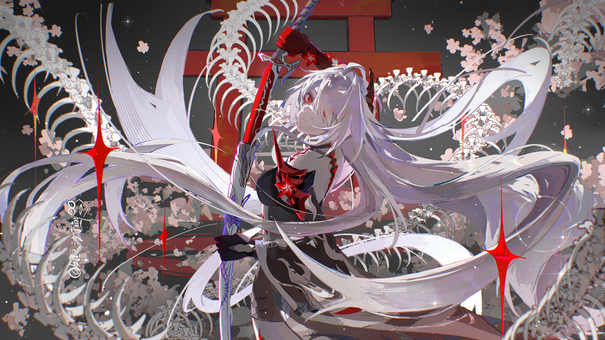
  
  
  
  
  
  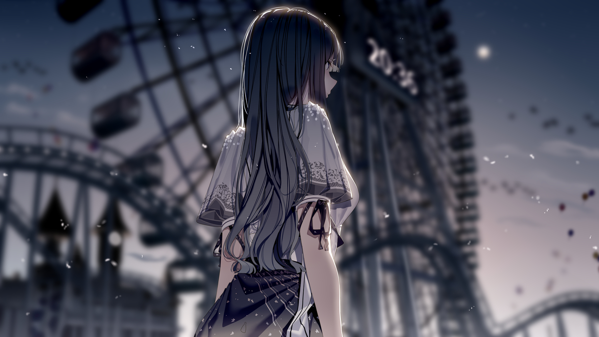
  
  
  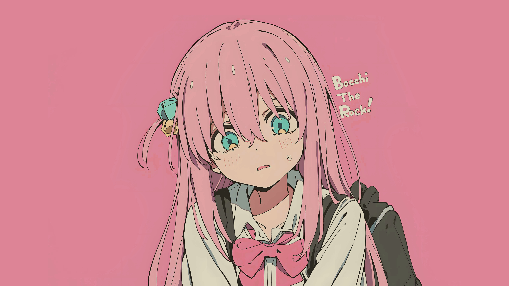
  
  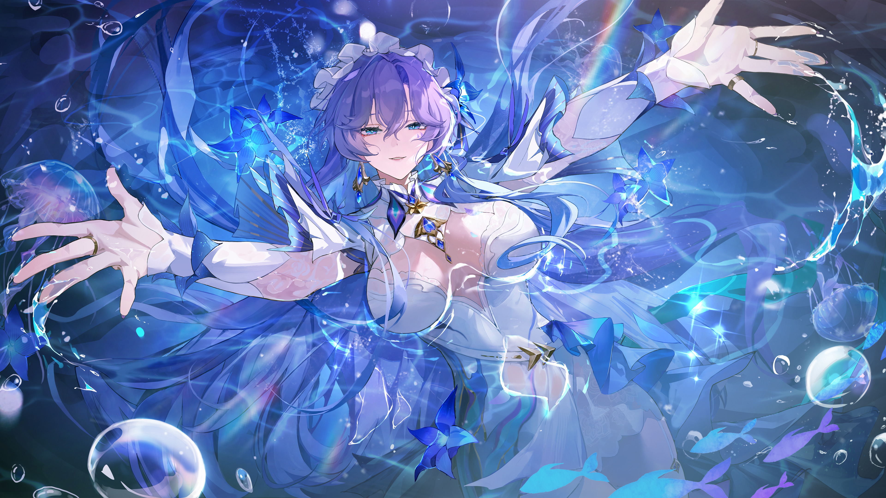
  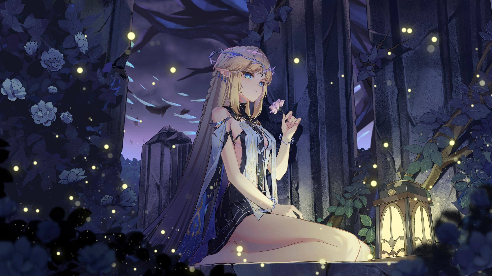
  
  
  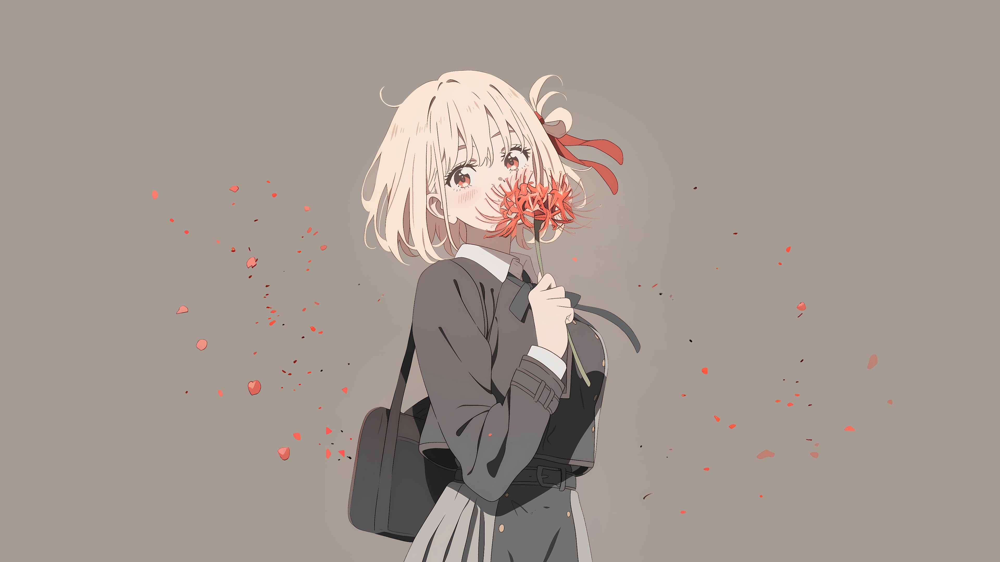
  
  
  
  
  
  
  
  
  
  
  
  
  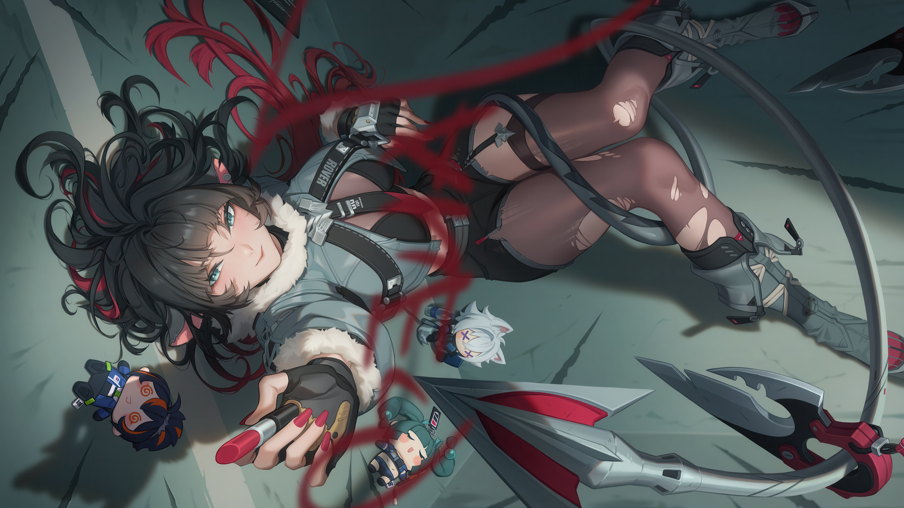
  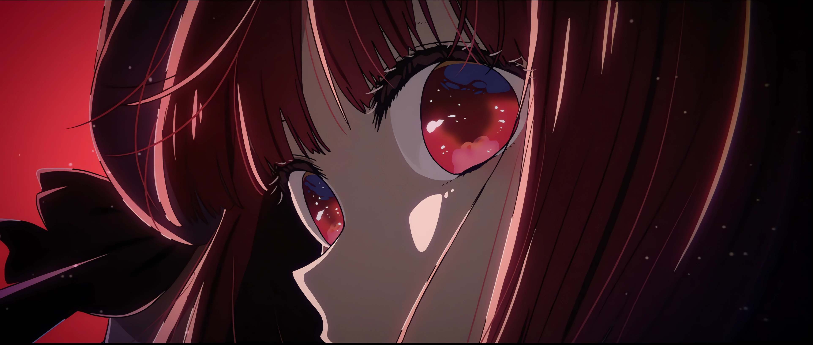
  
  
  
  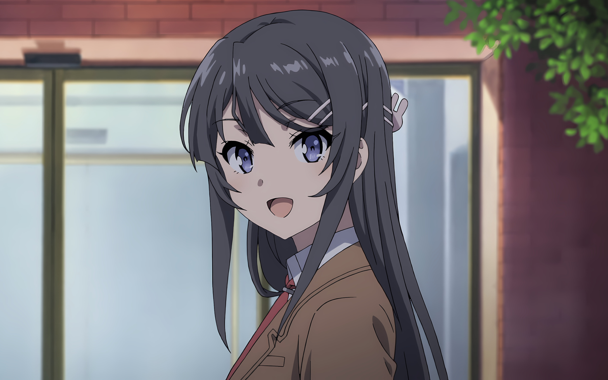
  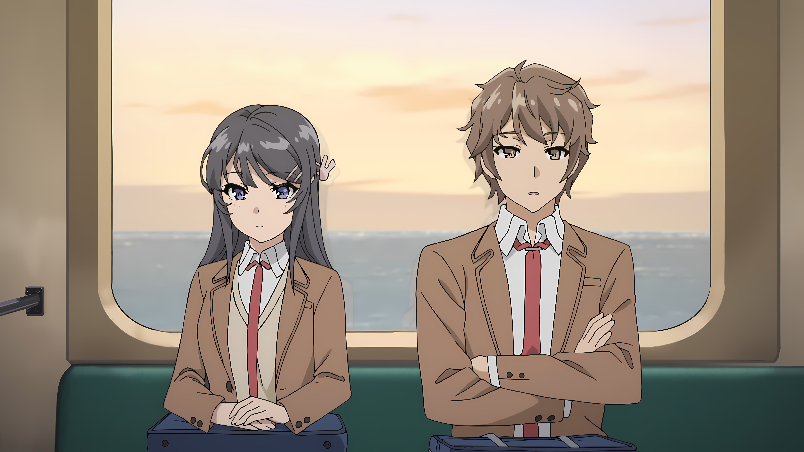
  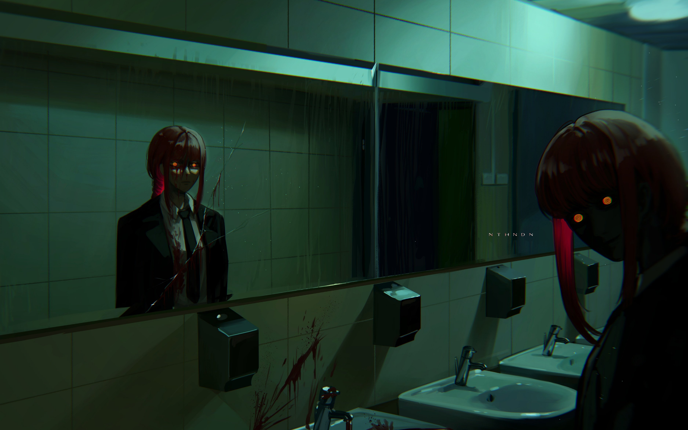
  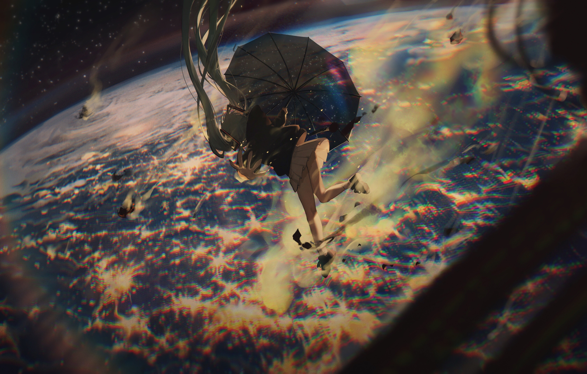
  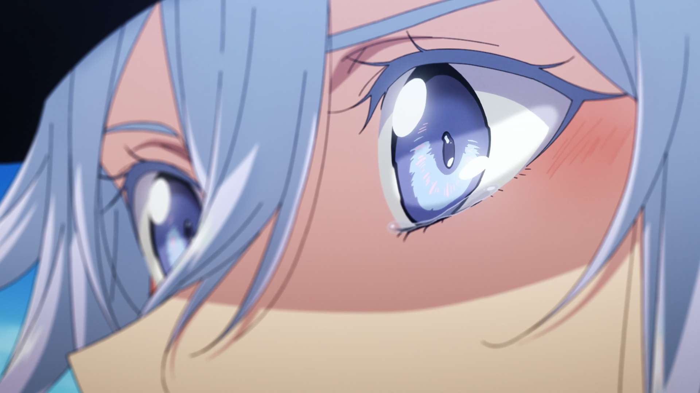
  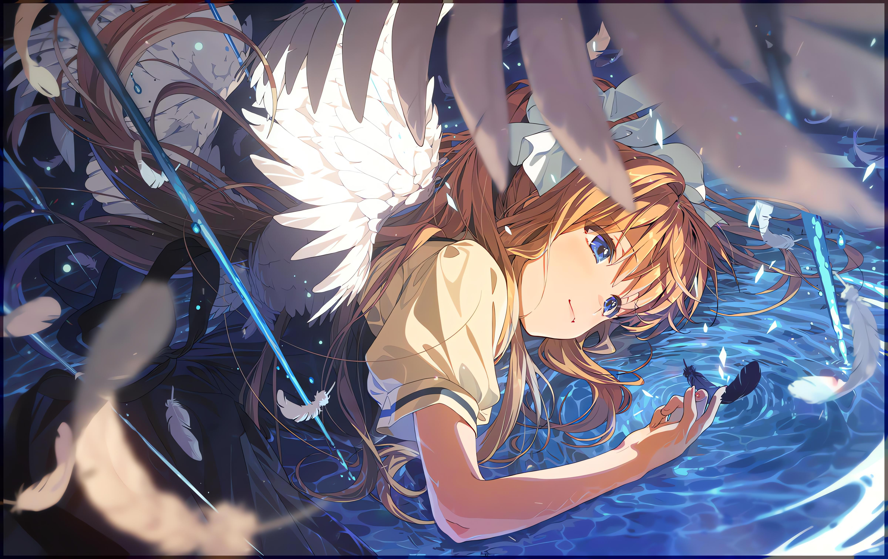
  
  
  
  
  
  
  
  
  
  
  
  
  
  
  
  
  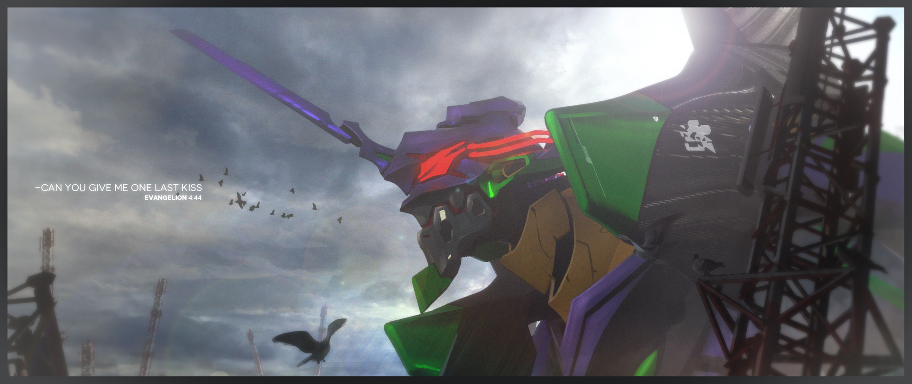
  
  
  
  
  
  
  
  
  
  
  
  
  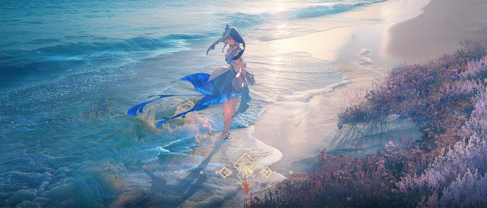
  
  
  
  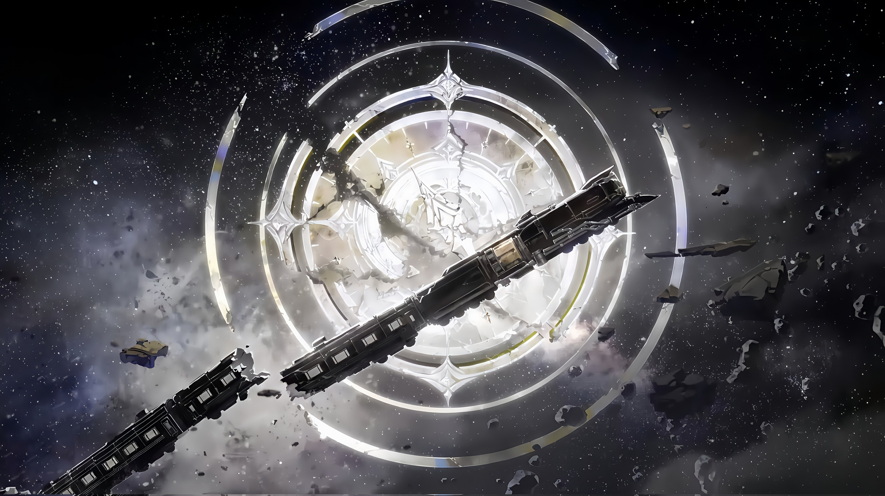

  

